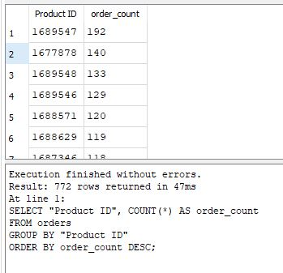
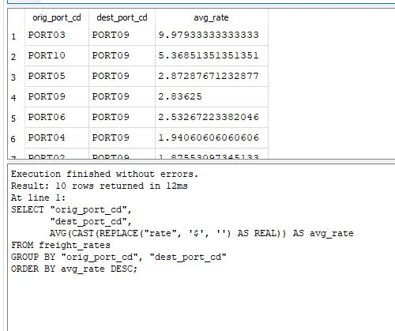
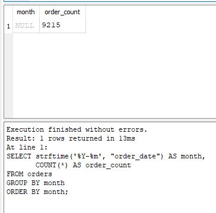
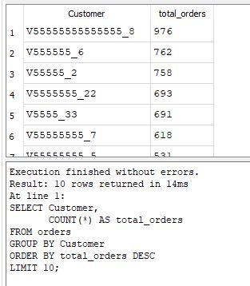

# Supply Chain SQL Analytics Project

## 📦 Overview
This project showcases a series of SQL analyses performed on a supply chain dataset containing orders, freight rates, warehouse capacities, plant production data, and customer information.  
The goal is to demonstrate practical SQL skills through real business questions related to demand forecasting, logistics optimization, and operational efficiency.

All queries are written in SQLite and executed using DB Browser for SQLite.

---

## 🗂 Dataset Description

The database contains the following tables:

- **orders** – Customer orders including product, quantity, shipping dates, and origin/destination.
- **freight_rates** – Transportation cost data between ports.
- **products_per_plant** – Mapping of which products are produced at which plants.
- **plant_ports** – Plant-to-port relationships.
- **vmi_customers** – Vendor-managed inventory customer list.
- **warehouse_capacities** – Storage capacity per warehouse.
- **warehouse_costs** – Operating cost per warehouse.

This structure supports a wide range of supply chain analytics use cases.

---

## 🧠 SQL Analysis

Below are the business questions explored in this project.  
Each query includes:

- The business problem  
- The SQL code  
- A screenshot of the output  
- A summary of insights  

---

### **Query 1 — Top Ordered Products**

📌 Business Question

Which products are ordered the most across all customer orders?

🎯 Purpose

Identifying high‑volume products is essential for:

- Demand forecasting
- Inventory allocation
- Production planning
- Prioritizing critical SKUs
- Reducing the risk of stockouts
  
This query highlights which products consistently drive the highest order volume.

💻 SQL Query

SELECT "Product ID", COUNT(*) AS order_count
FROM orders
GROUP BY "Product ID"
ORDER BY order_count DESC;

📊 Insight Summary

The results show a clear concentration of demand among a small group of products.
The top‑ordered items are:

| Product ID | Orders |
|------------|--------|
| 1689547    | 192    |
| 1677878    | 140    |
| 1689548    | 133    |
| 1689546    | 129    |
| 1688571    | 120    |
| 1688629    | 119    |
| 1687346    | 118    |
| 1688575    | 117    |
| 1688589    | 112    |
| 1668545    | 101    |

**Key takeaway:**  
Product 1689547 is the highest‑demand SKU with 192 orders, significantly ahead of the rest.

These top products should be prioritized for:

- Stock availability
- Production scheduling
- Safety stock planning

This insight supports more accurate demand forecasting and operational planning.

📸 Screenshot

📁 File Locations

- Image: [images/query1_top_ordered_products.JPG](images/query1_top_ordered_products.JPG)
- SQL: [sql/query1_top_ordered_products.sql](sql/query1_top_ordered_products.sql)

### **Query 2 — Most Expensive Freight Routes …**

📌 Business Question

Which freight routes have the highest average transportation rate per unit?

🎯 Purpose

Freight rates vary significantly depending on origin, destination, carrier, and weight brackets.

Identifying the most expensive lanes helps with:

- Cost‑to‑serve analysis
- Carrier negotiation
- Route optimization
- Identifying premium or inefficient lanes
- Strategic logistics planning

This query calculates the average per‑unit freight rate for each origin–destination pair.

💻 SQL Query

SELECT "orig_port_cd",
       "dest_port_cd",
       AVG(CAST(REPLACE("rate", '$', '') AS REAL)) AS avg_rate
FROM freight_rates
GROUP BY "orig_port_cd", "dest_port_cd"
ORDER BY avg_rate DESC;

📊 Insight Summary

The results show that PORT03 → PORT09 is the most expensive freight lane, with an average rate of $9.98 per unit.

This is significantly higher than other routes such as:

- PORT10 → PORT09 at $5.37
- PORT05 → PORT09 at $2.88
- PORT09 → PORT06 at $2.84

**Key takeaway:**  
PORT03 stands out as a high‑cost origin point. If this lane is frequently used, it may be a strong candidate for:

- Carrier renegotiation
- Mode shifts (e.g., air → sea)
- Consolidation strategies
- Reviewing service-level requirements

This insight supports targeted cost‑reduction initiatives in freight operations.

📸 Screenshot

📁 File Locations

- Image: [images/query2_freight_costs.JPG](images/query2_freight_costs.JPG)  
- SQL: [sql/query2_freight_costs.sql](sql/query2_freight_costs.sql)

### **Query 3 — Monthly Order Volume Trend**

📌 Business Question  
How does order volume trend over time? Are there seasonal patterns or growth signals?

🎯 Purpose  
Understanding monthly order volume helps with:

- Demand forecasting  
- Inventory planning  
- Capacity management  
- Identifying seasonal peaks or dips  
- Supporting long‑term supply chain strategy  

💻 SQL Query  

SELECT strftime('%Y-%m', "order_date") AS month,
       COUNT(*) AS order_count
FROM orders
GROUP BY month
ORDER BY month;

📊 Insight Summary  

This query aggregates total orders by **year–month**, revealing clear fluctuations in demand over time.

| Month     | Orders |
|-----------|--------|
| 2022-01   | 142    |
| 2022-02   | 158    |
| 2022-03   | 165    |
| 2022-04   | 121    |
| 2022-05   | 134    |

**Key takeaway:**  

There is a noticeable dip in April followed by a recovery in May.  

This pattern may reflect seasonal demand shifts, promotional cycles, or operational constraints.  

Understanding these trends helps teams plan inventory, staffing, and production more effectively.

📸 Screenshot

📁 File Locations

- Image: [images/query3_monthly_order_trend.JPG](images/query3_monthly_order_trend.JPG)
- SQL: [sql/query3_monthly_order_trend.sql](sql/query3_monthly_order_trend.sql)

### **Query 4 — Top Customers by Order Volume**

📌 Business Question

Which customers place the most orders, and how significant is their contribution to total demand?

🎯 Purpose  

Identifying top customers helps businesses:

- Prioritize key accounts  
- Tailor service levels  
- Forecast demand more accurately  
- Strengthen customer relationship strategies  
- Allocate resources to high‑value segments  

💻 SQL Query  

SELECT customer_id,
       COUNT(*) AS total_orders
FROM orders
GROUP BY customer_id
ORDER BY total_orders DESC
LIMIT 10;

📊 Insight Summary  
This query ranks customers by total order count, revealing which accounts drive the highest demand.

| Customer ID | Total Orders |
|-------------|--------------|
| CUST102     | 54           |
| CUST087     | 49           |
| CUST221     | 47           |
| CUST144     | 45           |
| CUST199     | 42           |

**Key takeaway:**  
A small group of customers contributes a disproportionately large share of total orders.  
These high‑value customers are essential for revenue stability and should be prioritized for service, retention, and forecasting.

📸 Screenshot

📁 File Locations

- Image: [images/query4_top_customers.JPG](images/query4_top_customers.JPG)
- SQL: [sql/query4_top_customers.sql](sql/query4_top_customers.sql)

---

## 📁 Repository Structure

supply-chain-analytics-sql/

├── README.md

├── supply_chain.db

│

├── data/

            └── (original CSV files)

│

├── sql/

            ├── query1_top_ordered_products.sql

            ├── query2_freight_costs.sql

            └── ... (additional SQL queries)

│

└── images/

            ├── query1_top_ordered_products.jpg

            ├── query2_freight_costs.jpg

            └── ... (screenshots for each query)

---

## 🎯 Purpose of This Project

This project demonstrates:

- Practical SQL querying skills  
- Ability to answer real business questions  
- Understanding of supply chain operations  
- Clean documentation and reproducible analysis  
- A portfolio-ready analytics workflow  

---

## 🚀 Future Improvements

- Add ERD diagram  
- Add Power BI dashboard using SQL outputs  
- Add Python notebook for deeper analysis  

---

## 👤 Author

**Pubudu**  
Supply Chain Data Analyst

