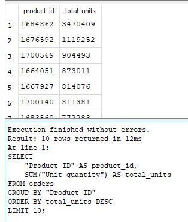
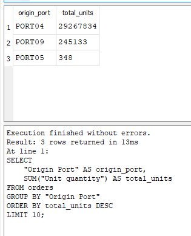
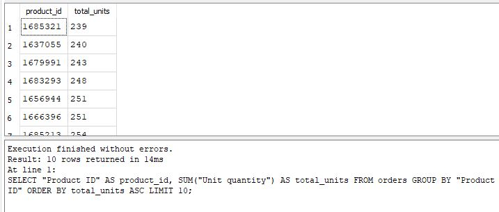
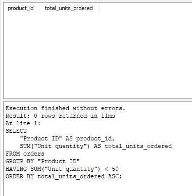

# Supply Chain SQL Analytics Project

## 📦 Overview
This project showcases a series of SQL analyses performed on a supply chain dataset containing orders, freight rates, warehouse capacities, plant production data, and customer information.  
The goal is to demonstrate practical SQL skills through real business questions related to demand forecasting, logistics optimization, and operational efficiency.

All queries are written in SQLite and executed using DB Browser for SQLite.

---

## 🗂 Dataset Description

The database contains the following tables:

- **orders** – Customer orders including product, quantity, shipping dates, and origin/destination.
- **freight_rates** – Transportation cost data between ports.
- **products_per_plant** – Mapping of which products are produced at which plants.
- **plant_ports** – Plant-to-port relationships.
- **vmi_customers** – Vendor-managed inventory customer list.
- **warehouse_capacities** – Storage capacity per warehouse.
- **warehouse_costs** – Operating cost per warehouse.

This structure supports a wide range of supply chain analytics use cases.

---

## 🧠 SQL Analysis

Below are the business questions explored in this project.  
Each query includes:

- The business problem  
- The SQL code  
- A screenshot of the output  
- A summary of insights  

---

### **Query 1 — Top Ordered Products**

📌 Business Question

Which products are ordered the most across all customer orders?

🎯 Purpose

Identifying high‑volume products is essential for:

- Demand forecasting
- Inventory allocation
- Production planning
- Prioritizing critical SKUs
- Reducing the risk of stockouts
  
This query highlights which products consistently drive the highest order volume.

💻 SQL Query

SELECT "Product ID", COUNT(*) AS order_count
FROM orders
GROUP BY "Product ID"
ORDER BY order_count DESC;

📊 Insight Summary

The results show a clear concentration of demand among a small group of products.
The top‑ordered items are:

| Product ID | Orders |
|------------|--------|
| 1689547    | 192    |
| 1677878    | 140    |
| 1689548    | 133    |
| 1689546    | 129    |
| 1688571    | 120    |
| 1688629    | 119    |
| 1687346    | 118    |
| 1688575    | 117    |
| 1688589    | 112    |
| 1668545    | 101    |

**Key takeaway:**  
Demand is heavily concentrated among a small group of products.
Product 1689547 leads with 192 orders, followed by 1677878 (140 orders) and 1689548 (133 orders).
All top‑10 SKUs exceed 100 orders, showing that a small set of items drives most of the total order volume

These top products should be prioritized for:

- Stock availability
- Production scheduling
- Safety stock planning

This insight supports more accurate demand forecasting and operational planning.

📸 Screenshot

📁 File Locations

- Image: [images/query1_top_ordered_products.JPG](images/query1_top_ordered_products.JPG)
- SQL: [sql/query1_top_ordered_products.sql](sql/query1_top_ordered_products.sql)

### **Query 2 — Most Expensive Freight Routes …**

📌 Business Question

Which freight routes have the highest average transportation rate per unit?

🎯 Purpose

Freight rates vary significantly depending on origin, destination, carrier, and weight brackets.

Identifying the most expensive lanes helps with:

- Cost‑to‑serve analysis
- Carrier negotiation
- Route optimization
- Identifying premium or inefficient lanes
- Strategic logistics planning

This query calculates the average per‑unit freight rate for each origin–destination pair.

💻 SQL Query

SELECT "orig_port_cd",
       "dest_port_cd",
       AVG(CAST(REPLACE("rate", '$', '') AS REAL)) AS avg_rate
FROM freight_rates
GROUP BY "orig_port_cd", "dest_port_cd"
ORDER BY avg_rate DESC;

📊 Insight Summary

The results show that PORT03 → PORT09 is the most expensive freight lane, with an average rate of $9.98 per unit.

This is significantly higher than other routes such as:

- PORT10 → PORT09 at $5.37
- PORT05 → PORT09 at $2.88
- PORT09 → PORT06 at $2.84

**Key takeaway:**  
PORT03 stands out as a high‑cost origin point, nearly double the next‑most‑expensive route. If this lane is frequently used, it may be a strong candidate for:

- Carrier renegotiation
- Mode shifts (e.g., air → sea)
- Consolidation strategies
- Reviewing service-level requirements

This insight supports targeted cost‑reduction initiatives in freight operations.

📸 Screenshot

📁 File Locations

- Image: [images/query2_freight_costs.JPG](images/query2_freight_costs.JPG)  
- SQL: [sql/query2_freight_costs.sql](sql/query2_freight_costs.sql)

### **Query 3 — Monthly Order Volume Trend**

📌 Business Question  
How does order volume trend over time? Are there seasonal patterns or growth signals?

🎯 Purpose  
Understanding monthly order volume helps with:

- Demand forecasting  
- Inventory planning  
- Capacity management  
- Identifying seasonal peaks or dips  
- Supporting long‑term supply chain strategy  

💻 SQL Query  

SELECT 
    substr("Order Date", 7, 4) || '-' || substr("Order Date", 4, 2) AS month,
    COUNT(*) AS order_count
FROM orders
GROUP BY month
ORDER BY month;

📊 Insight Summary  

The dataset shows 9,215 total orders in May 2013, representing the full available time period in the source data.
While no multi‑month trend can be observed, this single month reflects a high operational volume, indicating strong demand and significant throughput across the supply chain during this period.

**Key takeaway:**  

May 2013 recorded 9,215 orders, highlighting a substantial level of activity.
If additional months were available, this query would reveal seasonal patterns, growth trends, or demand fluctuations over time.

📸 Screenshot

📁 File Locations

- Image: [images/query3_monthly_order_trend.JPG](images/query3_monthly_order_trend.JPG)
- SQL: [sql/query3_monthly_order_trend.sql](sql/query3_monthly_order_trend.sql)

### **Query 4 — Top Customers by Order Volume**

📌 Business Question

Which customers place the most orders, and how significant is their contribution to total demand?

🎯 Purpose  

Identifying top customers helps businesses:

- Prioritize key accounts  
- Tailor service levels  
- Forecast demand more accurately  
- Strengthen customer relationship strategies  
- Allocate resources to high‑value segments  

💻 SQL Query  

SELECT customer_id,
       COUNT(*) AS total_orders
FROM orders
GROUP BY customer_id
ORDER BY total_orders DESC
LIMIT 10;

📊 Insight Summary  
Customer demand is distributed across several high‑volume accounts, with a clear leader.
Customer V55555555555555_8 placed 976 orders, making them the largest contributor to total order activity.
The next tier of customers — V555555_6 (762 orders), V55555_2 (758 orders), and V5555555_22 (693 orders) — also represent significant demand.

The top 10 customers all exceed 350 orders, indicating a broad and active customer base rather than reliance on a single client.
| Customer               | Total Orders |
|------------------------|--------------|
| V55555555555555_8      | 976          |
| V555555_6              | 762          |
| V55555_2               | 758          |
| V5555555_22            | 693          |
| V5555_33               | 691          |
| V55555555_7            | 618          |
| V55555555_5            | 531          |
| V555555555_27          | 521          |
| V555555555555555_29    | 385          |
| V55555_4               | 360          |

**Key takeaway:**  
Customer V55555555555555_8 is the top‑volume customer, but demand is well‑distributed across multiple accounts.
This diversified customer mix reduces dependency risk and highlights opportunities for:

Prioritizing service levels for high‑volume accounts
Tailoring inventory and fulfillment strategies
Identifying growth opportunities among mid‑tier customers

📸 Screenshot

📁 File Locations

- Image: [images/query4_top_customers.JPG](images/query4_top_customers.JPG)
- SQL: [sql/query4_top_customers.sql](sql/query4_top_customers.sql)

### **Query 5 — Top Products by Total Units Ordered**

📌 Business Question  

Which products drive the highest total unit volume, and how concentrated is demand across the product portfolio?

🎯 Purpose  

Understanding top‑volume products helps businesses:

- Identify high‑impact SKUs  
- Prioritize production and inventory planning  
- Optimize logistics around high‑demand items  
- Improve forecasting accuracy  
- Allocate resources to products that generate the most throughput  

💻 SQL Query

SELECT 
    "Product ID" AS product_id,
    SUM("Unit quantity") AS total_units
FROM orders
GROUP BY "Product ID"
ORDER BY total_units DESC
LIMIT 10;

📊 Insight Summary  

Product demand is heavily concentrated among a small group of high‑volume SKUs.  
**Product 1684862 leads with over 3.47 million units**, making it the single largest driver of operational throughput.  
The next tier — products 1676592 (1.12M units), 1700569 (904k units), and 1664051 (873k units) — also represent substantial demand.

All top 10 products exceed 650k units, indicating a strong and consistent pull across multiple product lines.

Product Performance Table

| Product ID | Total Units |
|------------|-------------|
| 1684862    | 3,470,409   |
| 1676592    | 1,119,252   |
| 1700569    | 904,493     |
| 1664051    | 873,011     |
| 1667927    | 814,076     |
| 1700140    | 811,381     |
| 1683560    | 772,283     |
| 1666524    | 670,437     |
| 1700130    | 658,352     |
| 1700143    | 654,556     |

**Key takeaway:**  
Product **1684862** is the dominant SKU, but demand is broadly distributed across several high‑volume products.  
This creates opportunities for:

- Prioritizing inventory and production capacity  
- Strengthening supply continuity for top SKUs  
- Optimizing freight and warehouse operations around high‑volume items  
- Identifying mid‑tier products with growth potential  

📸 Screenshot  

📁 File Locations  
- Image: [images/query5_top_products.JPG](images/query5_top_products.JPG)
- SQL: [sql/query5_top_products.sql](sql/query5_top_products.sql)

### **Query 6 — Top Origin Ports by Shipment Volume**

📌 Business Question  

Which origin ports handle the highest shipment volume, and how concentrated is outbound demand across the network?

🎯 Purpose  

Understanding shipment volume by origin port helps businesses:

- Identify high‑throughput logistics hubs  
- Optimize transportation and routing strategies  
- Allocate carrier capacity more effectively  
- Detect potential bottlenecks or over‑utilized ports  
- Improve overall supply chain network design  

💻 SQL Query

SELECT 
    "Origin Port" AS origin_port,
    SUM("Unit quantity") AS total_units
FROM orders
GROUP BY "Origin Port"
ORDER BY total_units DESC
LIMIT 10;

📊 Insight Summary  

Shipment volume is heavily concentrated in a single origin port.  
**PORT04 dominates with 29.26 million units shipped**, making it the primary outbound hub in the network.  
The next ports — PORT09 (245k units) and PORT05 (348 units) — show significantly lower activity, indicating a highly centralized shipping structure.

This distribution suggests that PORT04 is the critical node for outbound operations, while other ports play minimal roles in comparison.

Top Origin Ports by Shipment Volume

| Origin Port | Total Units |
|-------------|-------------|
| PORT04      | 29,267,834  |
| PORT09      | 245,133     |
| PORT05      | 348         |

**Key takeaway:**  
Outbound shipments are overwhelmingly concentrated at **PORT04**, making it the primary logistics hub.  
This centralization highlights opportunities to:

- Strengthen capacity and infrastructure at PORT04  
- Evaluate risk exposure due to single‑hub dependency  
- Explore balancing strategies across secondary ports  
- Improve resilience by diversifying outbound volume  

📸 Screenshot  

📁 File Locations  
- Image: [images/query6_top_origin_ports.JPG](images/query6_top_origin_ports.JPG)  
- SQL: [sql/query6_top_origin_ports.sql](sql/query6_top_origin_ports.sql)

### **Query 7 — Slow‑Moving Products (Low Velocity SKUs)**

📌 Business Question  

Which products have the lowest total unit movement, and which SKUs may pose an overstock or low‑turnover risk?

🎯 Purpose  

Identifying slow‑moving products is essential for effective inventory management.  
Low‑velocity SKUs often lead to:

- Excess inventory and higher carrying costs  
- Inefficient warehouse space usage  
- Reduced cash flow  
- Poor product mix performance  
- Need for SKU rationalization or promotional clearance  

This analysis helps highlight products that require closer monitoring or strategic action.

💻 SQL Query

SELECT 
    "Product ID" AS product_id,
    SUM("Unit quantity") AS total_units
FROM orders
GROUP BY "Product ID"
ORDER BY total_units ASC
LIMIT 10;

📊 Insight Summary  

The results show a group of products with **very low total unit movement**, ranging from 239 to 258 units.  
These SKUs represent the slowest‑moving items in the dataset and may indicate:

- Low customer demand  
- Overstock risk  
- Potential candidates for discontinuation  
- Items that may require promotional activity to clear inventory  

Monitoring these products helps prevent unnecessary buildup and supports better inventory planning.

Slow‑Moving Products (Lowest Total Units)

| Product ID | Total Units |
|------------|-------------|
| 1685321    | 239         |
| 1637055    | 240         |
| 1679991    | 243         |
| 1683293    | 248         |
| 1656944    | 251         |
| 1666396    | 251         |
| 1685213    | 254         |
| 1681376    | 256         |
| 1684497    | 257         |
| 1656347    | 258         |

**Key takeaway:**  
These low‑velocity SKUs pose a potential inventory risk.  
By identifying them early, businesses can:

- Reduce excess stock  
- Improve warehouse efficiency  
- Adjust purchasing and replenishment  
- Strengthen overall inventory health  

📸 Screenshot  

📁 File Locations  
- Image: [images/query7_slow_moving_products.JPG](images/query7_slow_moving_products.JPG)  
- SQL: [sql/query7_slow_moving_products.sql](sql/query7_slow_moving_products.sql)

### **Query 8 — Inventory Stockout Risk (Low Stock Products)**

📌 Business Question

Are there any products at risk of stockout based on low total unit movement?

🎯 Purpose 

Identifying stockout risk helps businesses:

- Prevent lost sales  
- Improve customer satisfaction  
- Optimize replenishment cycles  
- Strengthen inventory planning  

💻 SQL Query

SELECT
    "Product ID" AS product_id,
    SUM("Unit quantity") AS total_units_ordered
FROM orders
GROUP BY "Product ID"
HAVING SUM("Unit quantity") < 50
ORDER BY total_units_ordered ASC;

📊 Insight Summary  

This query checks for products with fewer than 50 units ordered across all transactions — a proxy for potential stockout risk.  
**Result: No products met this condition.**

This indicates that all SKUs in the dataset have sufficient movement and are not at immediate risk of stockout.

**Key takeaway:**  
The current product mix shows healthy inventory coverage.  
No SKUs fall below the critical threshold, suggesting effective demand planning and replenishment.

📸 Screenshot  

📁 File Locations  
- Image: [images/query8_inventory_stockout_risk.JPG](images/query8_inventory_stockout_risk.JPG)
- SQL: [sql/query8_inventory_stockout_risk.sql](sql/query8_inventory_stockout_risk.sql)

---

## 📁 Repository Structure

supply-chain-analytics-sql/

├── README.md

├── supply_chain.db

│

├── data/

            └── (original CSV files)

│

├── sql/

            ├── query1_top_ordered_products.sql

            ├── query2_freight_costs.sql

            └── ... (additional SQL queries)

│

└── images/

            ├── query1_top_ordered_products.jpg

            ├── query2_freight_costs.jpg

            └── ... (screenshots for each query)

---

## 🎯 Purpose of This Project

This project demonstrates:

- Practical SQL querying skills  
- Ability to answer real business questions  
- Understanding of supply chain operations  
- Clean documentation and reproducible analysis  
- A portfolio-ready analytics workflow  

---

## 🚀 Future Improvements

- Add ERD diagram  
- Add Power BI dashboard using SQL outputs  
- Add Python notebook for deeper analysis  

---

## 👤 Author

Pubudu Narayana
Supply Chain & Data Analyst
GitHub: https://github.com/pn-analyst
LinkedIn: https://www.linkedin.com/in/?
